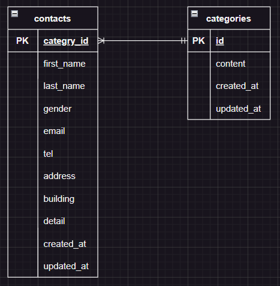

# お問い合わせフォーム

## 環境構築

Docker ビルド

1. git clone リンク
2. docker-compose up -d --build

- MySQL は、OS によって起動しない場合があるのでそれぞれの PC に合わせて docker-compose.yml ファイルを編集してください。

Laravel 環境構築

1. docker-compose exec php bash
2. composer instal
3. env.example ファイルから.env を作成し、環境変数を変更
4. php artisan key:generate
5. php artisan migrate
6. php artisan db:seed

## 使用技術(実行環境)

PHP 7.4.9
Laravel Framework 8.83.8
mysql 8.0.26

## ER 図

## URL

開発環境:http://localhost/
phpMyAdmin:http://localhost:8080/
